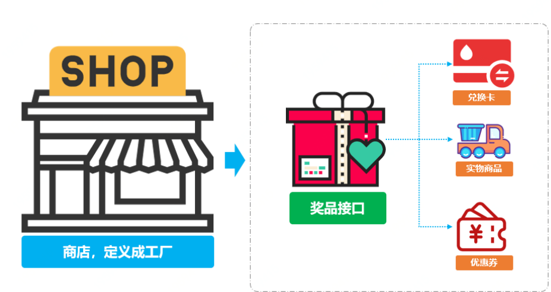

2024年6月21日14:30:17 更新

## 1.概述说明

工厂方法模式，旨在借助工厂的统一入口完成不同对象的创建工作。它能比较有效地将不同的工厂产出对象分隔开来，让它们彼此之间耦合性降到最低。同时，基于分隔的特性，它们也能根据后续的外部需求，不断地派生出新的工厂对象出来，以独立的解决新的问题。

来一个，就创建一个。虽然可能会出现子类过多的情况，但是至少能在隔离性上起到划分的作用。另一方面，这种处理方式也能让代码变地更为整洁和优雅。

它的主要意图是定义一个创建对象的接口，让其子类自己决定实例化哪一个工厂类。工厂模式可以使其创建过程延迟到子类进行。

本demo全程参考自小傅哥的《重学涉及模式》小册。

## 2.场景说明

模拟发放多种奖品

如图所示，现在商店正在进行根据积分兑换不同奖品的活动。兑换的奖品主要有兑换卡，实物商品，以及优惠券这三类。

现在需要通过代码实现奖品兑换这一过程。

## 2.实现说明

结合图例，我们很明显地知道即将实现的代码将包含3钟不同兑换奖品的实现。

通常情况下，由于此处涉及的情况较少，我们是可以直接用if判断逻辑的方式，来完成不同奖品的兑换处理逻辑。

但这种处理办法会带来一个问题：如果又新增了其他的奖品，继续沿用if的判断方式，势必将会让代码变地冗长和难以理解（**没有谁会喜欢一大堆且需要自己去细理逻辑的代码**）。

采用工厂模式处理方式的好处在这里就能显而易见了：由于工厂模式可以使子类的创建过程延迟到子类进行，即每一个奖品都有自己的独立实现。奖品间不会互相影响，且各奖品可以独自丰富自己的逻辑（比如实物奖品中的二换一，优惠券的叠加使用等）。

