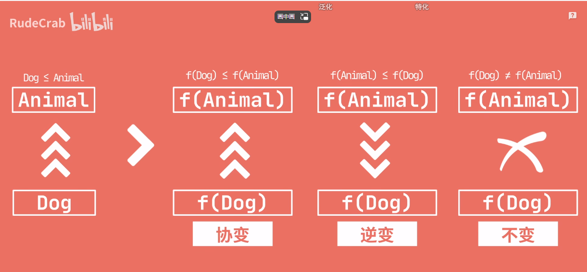
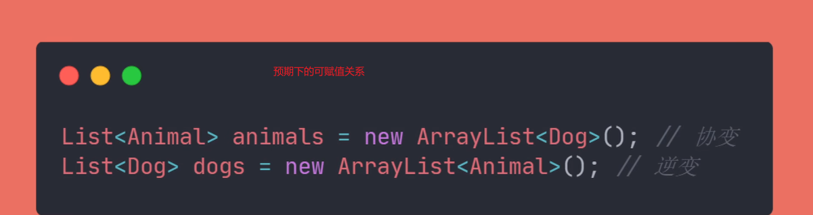

### Java泛型中的协变和逆变

* 

本文内容摘自视频链接
https://www.bilibili.com/video/BV18d4y1m75K/?spm_id_from=333.788&vd_source=2311480cef8f2682759be4b8b51781ca

* 

### 1.变型分类

我们先来看看Java中的几种“变型”

那这几种变型分别代表什么意思呢？

我们以经典的Animal和Dog类作为样例来说明。

视频中关于这几种变型的专业类说法叫：**类型构造器如何影响父子类型之间的关系？**

* 协变
  
  专业的说法理解起来有点绕。此处我暂时就先以自己的理解来作解释。参考图例，由f(Dog)可以推导初f（Animal）的逻辑关系可以解释成：通过狗这一样例对象，可以推导出它是属于Animal的一种品类。即由子类是可以“协助”获取到其所属的父级“品类”的。
* 逆变
  
  与之类似，f（Animal）推导出f（Dog）的逻辑关系可以解释成：Dog是Animal的一种具象体现。由父品类“蜕变”成一个具体的子品类，该过程是一个与常识相逆的改变，故可称其为逆变。
* 不变
  
  就是字面意思，不做改变。
  
  结合上述的说明，我们预期下的集合赋值逻辑关系是这样的。
  

但是在Java集合中，默认是不支持协变的。

为什么呢？

因为真支持的话，会造成类型添加的错误，从而导致编译错误。简而言之就是为了类型安全的考虑，所以禁用了协变。

如下面的两个图所示。

**需要注意的是Java的数组类型对象是可以支持协变的（因为Java1.0的初期版本并没有泛型，但又需要考虑到兼容，于是就有了这个“支持”），但这种协变会带来另一个问题：编译时期没有问题，但是在运行时，就会出现类型异常的错误**

支持的同时，也会带来相应的安全隐患。

### 2.泛型协变与上边界

接下来，我们看下日常开发中的一个常见场景。因为集合默认不支持协变，导致后续逻辑无法继续下去。

这种统一处理父类对象，然后传入子类对象的方式，在开发中还是比较常见的。

那该怎么办呢？

使用通配符“?”+extend关键字即可。这样，就能让泛型支持协变了。

此处的通配符+extends，就指明了该方法的参数的是继承自Animal，说明只能入参是Animal本类或者其子类，才能正常地通过编译。

**此处的‘泛型协变’虽然解决了传入方法集合参数子类的问题。同前面所述的数组类似，它仍然存在着一定的安全隐患：因为支持协变，所以可以在编译期赋予其他类型的元素，可能会在运行时则会报错：因为‘其他类型’不在指定的元素类型中。**

出于安全的考虑，“泛型协变”将**拒绝插入类的操作（除了插入无效值null外），只允许读取类的操作存在**。

至此，“泛型协变”的好处和产生原因也就解释清楚了。既然协变支持的是方法定义参数为父类，实际传入参数为子类。

### 3.泛型逆变与下边界

**那反过来呢？即方法中定义的是子类，但传入参数是父类的场景又该怎么做呢？**

考虑到这种场景也是开发中比较常见的。泛型自然也是有相应的支持方法，那就是“泛型的逆变”。逆者，以小博大也。

在此基础上扩展，允许传入父类参数。此时，就需要使用？+super关键字，来限定入参的下界。

通过这样的设定后，就允许传入的参数是Dog类的父类了。

泛型逆变还支持添加super后对象的本类及其子类。但不能添加其他的元素类型。

同样的，泛型逆变也有一定的取舍在里面。由于它接收到的参数是Dog的父类，但并不知道这个‘父类’到底是个什么对象。

所以，在做对象读取的时候，只能以object来接收。

综合来看，泛型逆变**支持写入，但不支持读取**。

那如何将两者结合起来呢？

自然是结合你的需求来，按需选择泛型的逆变和协变嘛，如果都不需要，那就指定到确定的类型即可。

用一张图来作“泛型的协变和逆变关系”的补充说明。

### 4.泛型的桥接方法

**纠正下，此处的擦除，正确的表述应为：擦除后，如果存在上界（即由extends关键字），则擦除为上界的基本类型。如果没有，或者说存在下界，则擦除为Object。**

### 5.泛型总结

最后，再一次重新来回答Java中泛型的实现机制。

1）类型擦除（要求包装类--->最终擦除为基本类型和原始类型）；

2）类型转换指令插入（泛型的协变、逆变、不变）；

3）桥接方法生成（编译器自动生成，开发者无需关注）；

