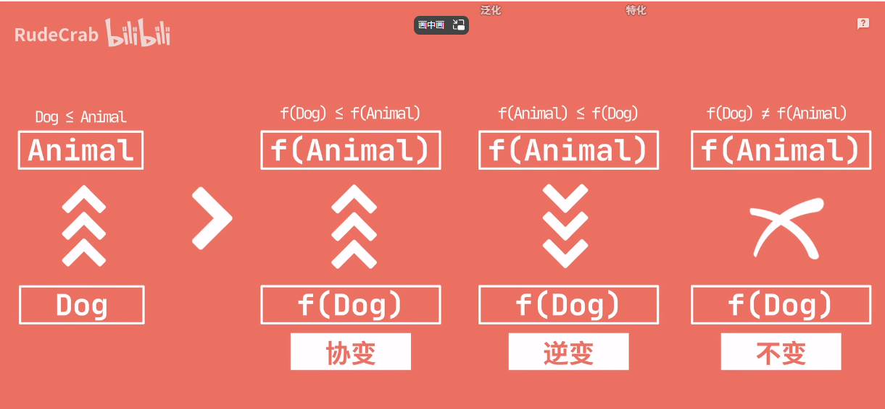

### Java泛型中的协变和逆变

* 

本文内容摘自视频链接
https://www.bilibili.com/video/BV18d4y1m75K/?spm_id_from=333.788&vd_source=2311480cef8f2682759be4b8b51781ca

* 

我们先来看看Java中的几种“变型”

那这几种变型分别代表什么意思呢？

我们以经典的Animal和Dog类作为样例来说明。

视频中关于这几种变型的专业类说法叫：**类型构造器如何影响父子类型之间的关系？**

* 协变
  专业的说法理解起来有点绕。此处我暂时就先以自己的理解来作解释。参考图例，由f(Dog)可以推导初f（Animal）的逻辑关系可以解释成：通过狗这一样例对象，可以推导出它是属于Animal的一种品类。即由子类是可以“协助”获取到其所属的父级“品类”的。
* 逆变
  与之类似，f（Animal）推导出f（Dog）的逻辑关系可以解释成：Dog是Animal的一种具象体现。由父品类“蜕变”成一个具体的子品类，该过程是一个与常识相逆的改变，故可称其为逆变。
* 不变
  就是字面意思，不做改变。
  

