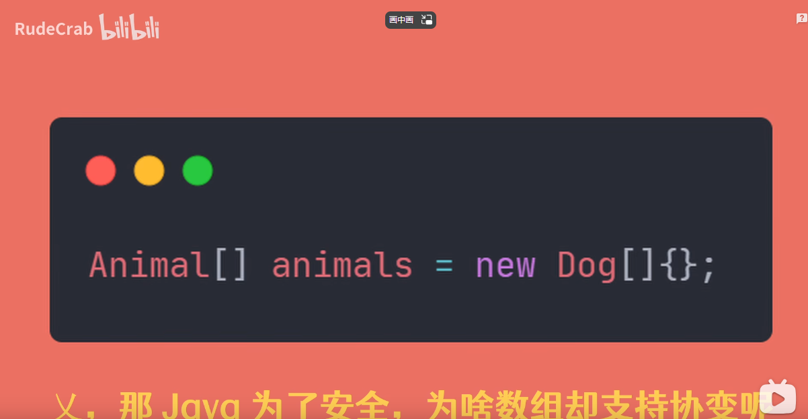

### Java泛型中的协变和逆变

* 

本文内容摘自视频链接
https://www.bilibili.com/video/BV18d4y1m75K/?spm_id_from=333.788&vd_source=2311480cef8f2682759be4b8b51781ca

* 

我们先来看看Java中的几种“变型”

那这几种变型分别代表什么意思呢？

我们以经典的Animal和Dog类作为样例来说明。

视频中关于这几种变型的专业类说法叫：**类型构造器如何影响父子类型之间的关系？**

* 协变
  
  专业的说法理解起来有点绕。此处我暂时就先以自己的理解来作解释。参考图例，由f(Dog)可以推导初f（Animal）的逻辑关系可以解释成：通过狗这一样例对象，可以推导出它是属于Animal的一种品类。即由子类是可以“协助”获取到其所属的父级“品类”的。
* 逆变
  
  与之类似，f（Animal）推导出f（Dog）的逻辑关系可以解释成：Dog是Animal的一种具象体现。由父品类“蜕变”成一个具体的子品类，该过程是一个与常识相逆的改变，故可称其为逆变。
* 不变
  
  就是字面意思，不做改变。
  
  结合上述的说明，我们预期下的集合赋值逻辑关系是这样的。
  

但是在Java集合中，默认是不支持协变的。

为什么呢？

因为真支持的话，会造成类型添加的错误，从而导致编译错误。简而言之就是为了类型安全的考虑，所以禁用了协变。

如下面的两个图所示。

**需要注意的是Java的数组类型对象是可以支持协变的（因为Java1.0的初期版本并没有泛型，但又需要考虑到兼容，于是就有了这个“支持”），但这种协变会带来另一个问题：编译时期没有问题，但是在运行时，就会出现类型异常的错误**

支持的同时，也会带来相应的安全隐患。

