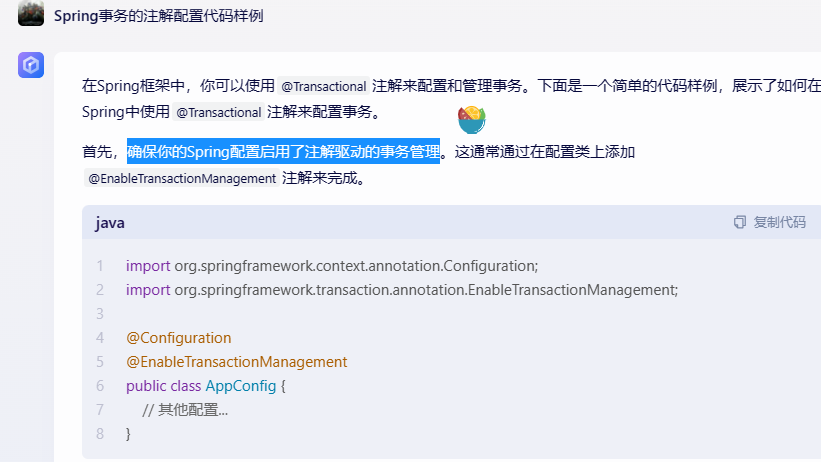

## Java事务常见要点摘录

***2024年2月28日09:34:29更新***

> 参考链接
> [Spring事务面试考点](https://www.cnblogs.com/lixinjie/p/spring-tx-key-point-in-a-interview.html)
> [Spring事务的配置、参数详情及其原理介绍(Transactional) - kosamino - 博客园](https://www.cnblogs.com/jing99/p/11495252.html)
> [Spring 事务详解 | JavaGuide](https://javaguide.cn/system-design/framework/spring/spring-transaction.html#%E5%8F%82%E8%80%83)
> [太难了~面试官让我结合案例讲讲自己对Spring事务传播行为的理解](https://mp.weixin.qq.com/s?__biz=Mzg2OTA0Njk0OA==&mid=2247486668&idx=2&sn=0381e8c836442f46bdc5367170234abb&chksm=cea24307f9d5ca11c96943b3ccfa1fc70dc97dd87d9c540388581f8fe6d805ff548dff5f6b5b&token=1776990505&lang=zh_CN#rd)

### 1.Spring和事务的关系

关系型数据库，某些消息队列（RocketMQ，RabbitMQ，Kafka等）或者一些中间件（比如大名鼎鼎的seata）等***事务性资源***，它们本身支持事务，也能处理事务。

但Spring不是事务性资源。从日常的开发中，我们可以得出结论：Spring管理事务性资源的一种方法。所以，Spring和事务之间是一个管理关系，而不是包好关系。

### 2.Spring事务的三要素

* 数据源：表示具体的事务性资源，事务相关操作的真正执行者，如MySQL等。
* 事务管理器：从整体上管理事务的处理过程，如打开，提交，回滚等。
* 事务应用和属性配置：用以标识哪些地方需要参与事务，如何参与事务（比如设置事务的隔离级别、传播级别，超时时间等）

#### 2.1 引申：事务的4大特性

* 原子性：要么全部成功，要么都失败。
* 持久性：修改动作产生的结果将被持久化存储。
* 隔离性：多个事务并发执行时，某一个具体事务的操作不影响其他事务的操作。
* 一致性：数据写入前和写入后，数据间本身的约束关系不会被破坏。

### 3.Spring事务的注解配置方式

* 在Spring中设置事务的常规方法

  ①：把一个DataSource（如DruidDataSource）作为一个@Bean注册到Spring容器中，配置好事务性资源。
  

  ②：把一个@EnableTransactionManagement注解放到一个@Configuration类上，配置好事务管理器，并启用事务管理。
  
  **注意：需要确保你是成功地启动了注解驱动的事务管理才行。**
  
  
  
  ③：把一个@Transactional注解放到类上或方法上，可以设置注解的属性，表明该方法按配置好的属性参与到事务中。
  
  
* **在Spring中设置事务的常规方法**
  
  前面的几幅图描述的即是在Spring中声明事务的常见配置方法。
* **在Springboot中设置事务的常规方法**
  
  在使用@Transactional的方法上,两者基本上是一致的。所不同的只是，Springboot已经自动的帮开发者完成了部分配置。开发者只需要结合自己的需求来加以补充即可。
  
  数据源的配置部分，直接通过pom依赖即可以完成。无需再到代码中去指定‘事务性资源’的bean对象。
  
  
  
  
* **两者的区别**

从前面的贴图可知，两者的主要不同在于‘事务性资源’和‘事务管理声明’两块儿有所不同。在实际的应用上基本上都是一致的。

#### 3.1 事务注解在类/方法上

#### 3.2 事务注解在类上的继承性

#### 3.3 事务注解在接口/类上

### 4.事务注解的本质

### 5.Spring事务的常见分型

#### 5.1 ★编程式事务

#### 5.2 ★声明式事务

### 6.事务生效

#### 6.1 只在public方法上生效？

#### 6.2 目标类里的自我调用没有事务？

### 7.回滚事务

#### 7.1 如何回滚一个事务

#### 7.2 默认回滚规则

#### 7.3 如何配置回滚异常

### 8.事务与线程

#### 8.1 逻辑事务与物理事务

#### 8.2 事务的传播特性

REQUIRED，SUPPORTS，MANDATORY，REQUIRES_NEW，NOT_SUPPORTED，NEVER，NESTED

##### 8.2.1 REQUIRED

#### 8.3 事务的隔离级别

##### 8.3.1 常见的几种错读方式

* 脏读
* 幻读
* 不可重复读

##### 8.3.2 不同事务隔离级别的作用

* DEFAULT
* READ_UNCOMMITTED
* READ_COMMITTED
* REPEATABLE_READ
* SERIALIZABLE

