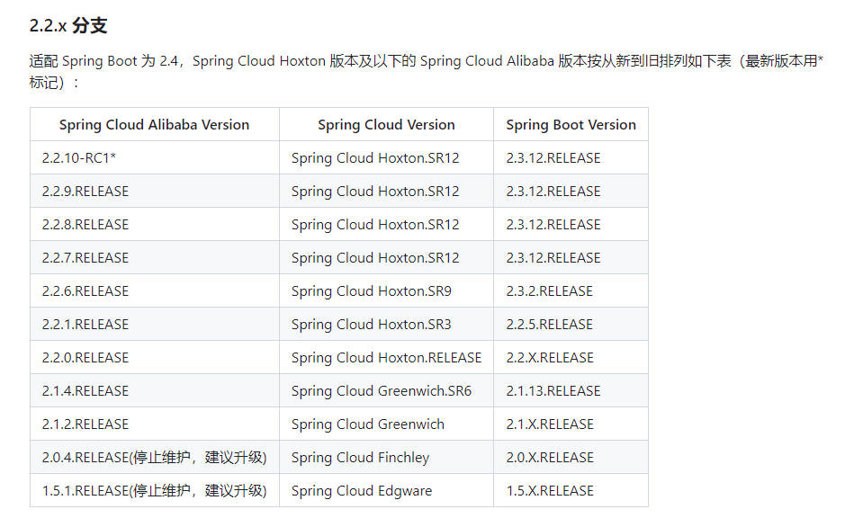

## **日期：*2023年7月25日***

### 1.帖子源址

[五十五张图告诉你微服务的灵魂摆渡者Nacos究竟有多强？](https://mp.weixin.qq.com/s?__biz=MzU3MDAzNDg1MA==&mid=2247493854&idx=1&sn=4b3fb7f7e17a76000733899f511ef915&scene=21#wechat_redirect)

---

### 正文部分

> 2023年7月25日15:55:30 更新

这里需要注意的是，在创建Spring Cloud Alibaba类的项目时，Spring boot，Spring Cloud，Spring Cloud Alibaba之间一定要把版本关系给整规矩了。

> 版本信息参见地址[Spring Cloud Alibaba集成版本说明](https://github.com/alibaba/spring-cloud-alibaba/wiki/%E7%89%88%E6%9C%AC%E8%AF%B4%E6%98%8E)

> 

> 2023年7月26日16:53:23 更新

一顿操作下来后，基本上都没什么问题了。一些需要注意的地方（比如共享配置这部分），
也一并在配置文件的注解中写清楚了。需要回顾的时候，去看看就好了。

这里主要就config的部分配置做个说明补充。

