2023年7月18日15:15:41 更新

这是一个用于实践SpringCloud-OpenFeign的工程。
简单记录下feign的常规用法。

> **[置]【参考帖子】[顶]**

> **Nacos版本声明：1.3.1**
> [openFeign夺命连环9问，这谁受得了？](https://juejin.cn/post/7010555899240513543#comment)

2023年7月20日09:48:12 更新
在实践的过程中，上来就遇到了一个多模块加载失败的问题。
就是子模块，不管怎么样，都不能正常的引入依赖，导入jar包。
从而造成我自己的工程缺胳膊少腿，运行不起来。
遇到问题，首要想的就是如何解决问题。
先是按照这个帖子了解了下，多模块工程间的逻辑关系。
[一篇解决springBoot+Maven多模块项目](https://blog.csdn.net/qq_40925189/article/details/103842208)

2023年7月20日11:08:48 更新
按照上面的帖子来处理了后，终于把项目工程不能成功导入依赖的问题解决了。

2023年7月20日15:54:37 更新
demo基本调整好有又遇到了另一个问题。
工程中的common模块，只是为了把consumer和provider中公共的部分给提出来，
并不需要单独启动的。但我在父工程中去install的时候，
idea却提示“Unable to find main class”。
就着这个报错，到网上去搜罗了下，
按照下述帖子的操作，加上了主类后，没有再报这个错误了。
[SpringBoot 多模块项目打包异常：Unable to find main class](https://https://blog.csdn.net/qq_42971035/article/details/125273869)
原因简述

> 因为 pom 集成了 boot-parent，打包时，在没有指定 mainClass 入口时，会找所有子模块下的 main 方法，除去 web 目录下有之外，其他模块下面均没有，导致打包异常。

解决方案

> **指定主类即可**

```
<configuration>			
     <mainClass>你工程中的主类</mainClass>
</configuration>
```

2023年7月20日16:37:56 更新
把前面的问题处理好后，在provider工程中引入了common模块的依赖。
整体父工程在install的时候，没有再出现“unable to find main class”的错误了。
可是，又出现了一个新错误：|
程序包com.wj.review.project.openfeign.common不存在
初步考虑是主启动类，在扫描路径上的问题。

2023年7月20日16:58:45 更新
上述问题，在下面的这两个帖子里找到了解决方法。
[帖子1-程序包XXX不存在问题解决](https://https://blog.csdn.net/github_39325328/article/details/85093007)
[帖子2-聚合maven+spring-boot打包可执行jar](https://https://blog.csdn.net/guduyishuai/article/details/60968728)

简单来说说原因吧。
我这里的工程，使用的是父parent中指定spring-boot-maven-plugin的方式。
其他子模块默认打出的jar包都是可执行的。
但是用作依赖的包，不能是可执行的：因为可执行的jar包是不能被依赖的。
所以，需要在被依赖的common工程中显示声明打出可执行包的。
解决办法呢，就是在Pom文件中显示的加上声明。

````
<build>
        <plugins>
            <plugin>
                <groupId>org.springframework.boot</groupId>
                <artifactId>spring-boot-maven-plugin</artifactId>
                <configuration>
                    <!-- 配置的classifier表示可执行jar的名字，配置了这个之后，
                    在插件执行repackage命令时，就不会给mvn package所打成的jar重命名了，
                    而打好包后的第一个jar表示可以被其他项目依赖的jar，第二个jar则表示一个可执行jar。
                    具体内容参见：
                    https://qinyin-yq.github.io/2020/04/09/SpringBoot%20%E5%A4%9A%E6%A8%A1%E5%9D%97%E9%A1%B9%E7%9B%AE%E6%89%93%E5%8C%85/
                    -->
                    <classifier>exec</classifier>
                </configuration>
            </plugin>
        </plugins>
    </build>
````

关于这个jar包的更详细的一个说明
[SpringBoot 多模块项目打包-关于jar包的一些知识点](https://qinyin-yq.github.io/2020/04/09/SpringBoot%20%E5%A4%9A%E6%A8%A1%E5%9D%97%E9%A1%B9%E7%9B%AE%E6%89%93%E5%8C%85/)
经过上述的调整后，项目终于是可以成功通过mvn install了。

2023年7月21日09:27:58 更新
前面的问题解决后，启动项目的时候，又遇到了新问题。

this version of the Java Runtime only recognizes class file versions up to 52.0

出现的是类似上述的错误。

经过一番排查后，发现是父工程中`spring-boot-starter-parent`和依赖项目`spring-boot-dependencies`
两个，前者的版本号低于后者的版本号，造成的问题。
经过下方两个帖子的说明，做了调整：将两者的版本做了统一后，问题才得以解决。
[帖子1-How to Fix java.lang.UnsupportedClassVersionError](https://www.baeldung.com/java-lang-unsupportedclassversion)
[帖子2-failed to introspect Class org.springframework.cloud.context.properties.ConfigurationPropertiesBea](https://blog.csdn.net/wwwwwww31311/article/details/118605144)
经过上述的调整，项目终于能够成功地启动起来了。

2023年7月21日11:06:23 更新
项目启动后，consumer工程没有把我的接口给映射出来。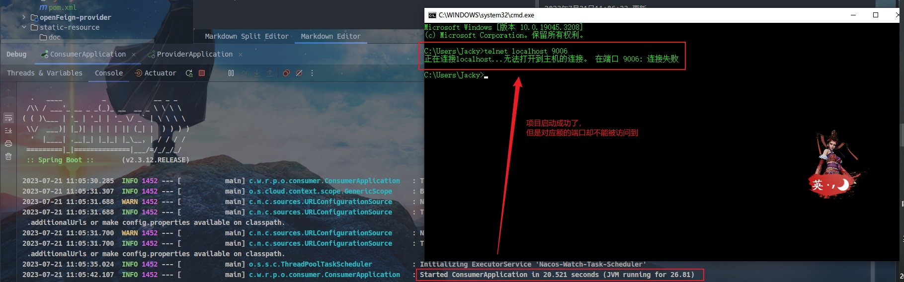
这可真是奇了怪了。
2023年7月21日11:29:10 更新
在比对了正常的provider工程后，发现consumer中没有加入`spring-boot-starter-web`的依赖，加入后就能正常地被访问到了。


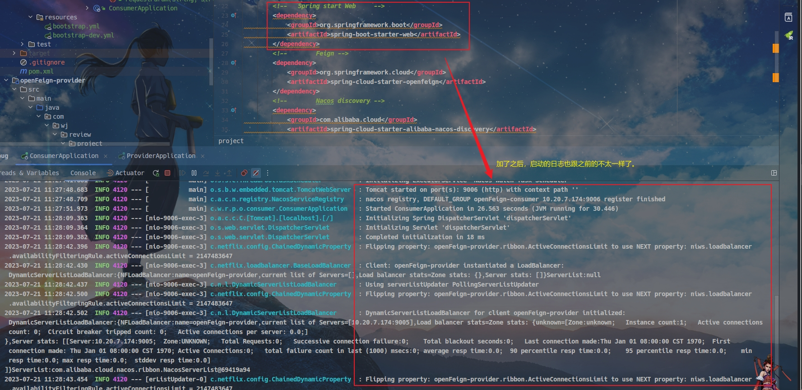

2023年7月21日11:38:25 更新
现在又遇到了一个新的问题。
虽然接口成功调通，但是接口没能获取到外部传入的参数。
这里首先采用的请求调用方法是 表单传参，接口只是以一个简单的对象接收。
需要注意的是，如果传入的参数在后台是以Date类型接收的，
则需要做相应的注解说明才行，不然会出现 类型转换错误的异常。
具体的说明链接在这里。
[springboot 使用DateTimeFormat接收Date参数](https://www.cnblogs.com/sunxun001/p/15774687.html)](https://www.cnblogs.com/sunxun001/p/15774687.html)
此处主要以演示为目的，故只简单地采用了String形式来接收外部入参。
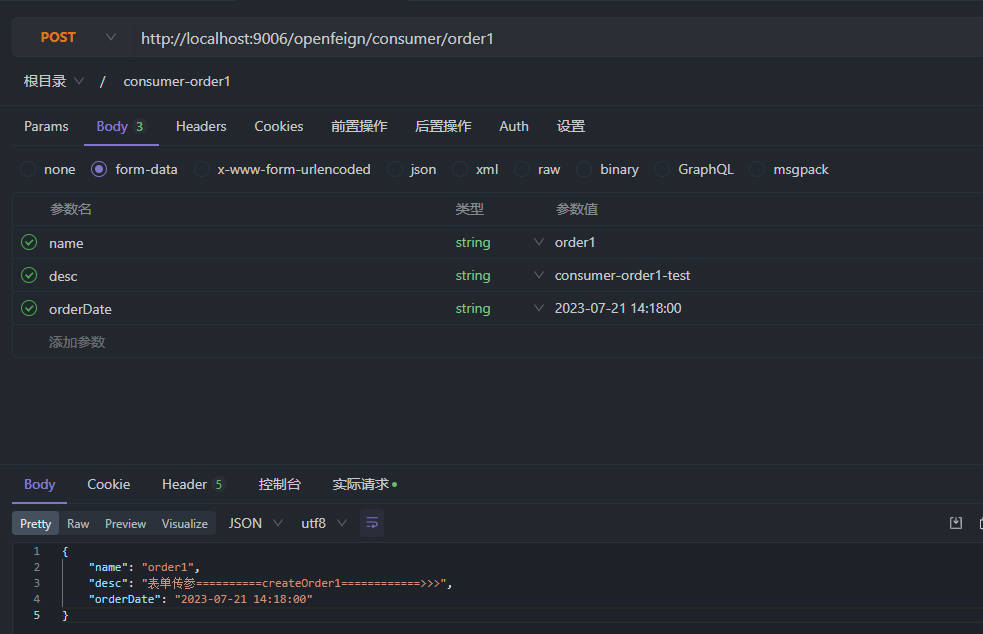
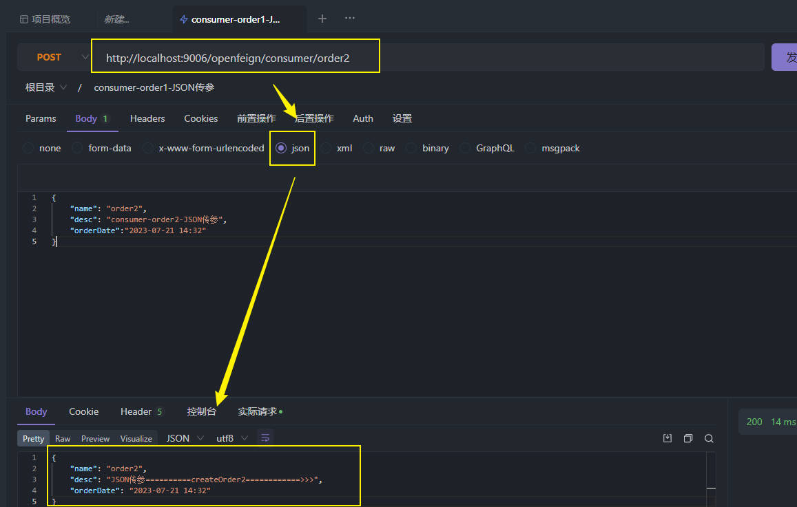
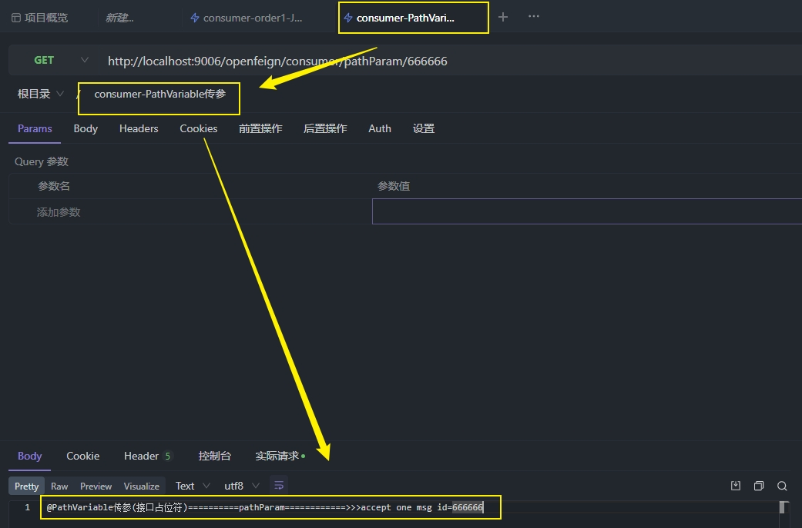
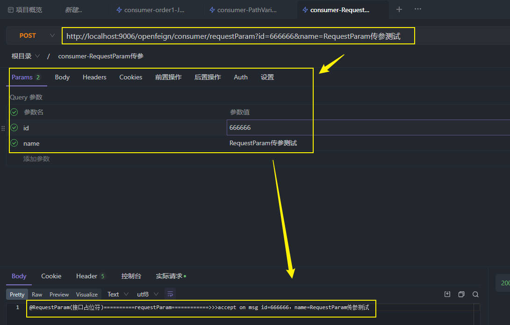

2023年7月21日15:50:45 更新
现在实践到了超时部分。
默认情况下OpenFeign由于集成了Ribbon，在不显示地配置超时时间的时候，它用的是Ribbon的超时时间，这个时间很短：1s。
如果有需要的，显示地去把超时时间设置好就行了。

超时设置参照下图。
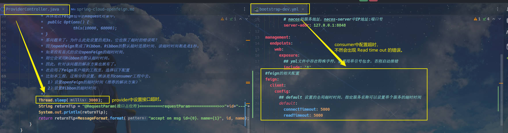

2023年7月21日16:33:33 更新
超时设置好后，我们还可需要根据日志来做一些请求上的追踪。
安排！
openFeign是有提供到相应的日志增强配置的。
具体的示意图如下（如果想用的，可以到源码中去看）
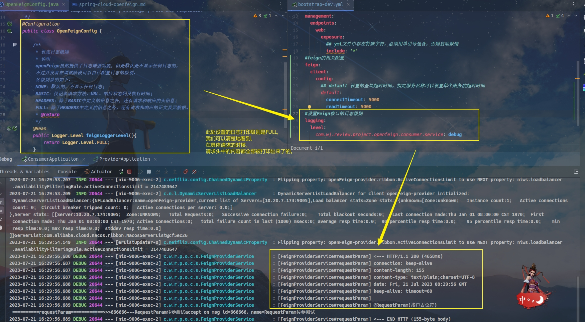

2023年7月21日16:59:44 更新
***替换默认的HttpClient***
默认的请求发起对象，不会用到连接池，
是有一个请求，就维护一个长连接。
所以我们需要将这种请求发起的场景切换到带连接池的请求对象上去。
最终的一个示意图如下
这里注意一个关键方法`feign.SynchronousMethodHandler#executeAndDecode()`
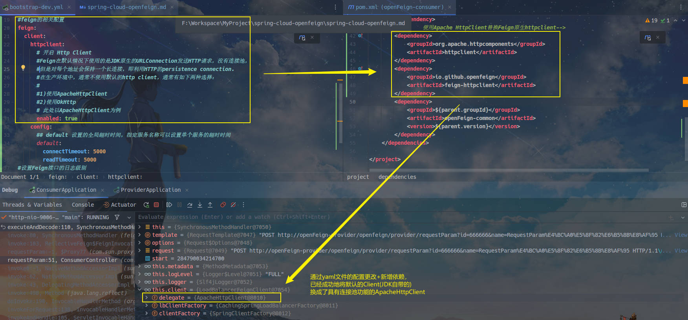

2023年7月21日17:05:51 更新
***通讯上的优化***
简单来说，就是请求端和服务端通过指定相同的压缩方式，
来压缩请求数据，从而提高接口交互效率。
更具体的说明可以参见置顶帖中的解释。
此处，我们以OpenFeign的GZIP压缩来举例。
最终的一个实现效果如下图。
可以参考的相关博文
[SpringBoot开启Gzip接口报文压缩](https://www.cnblogs.com/zgq7/p/17544290.html)

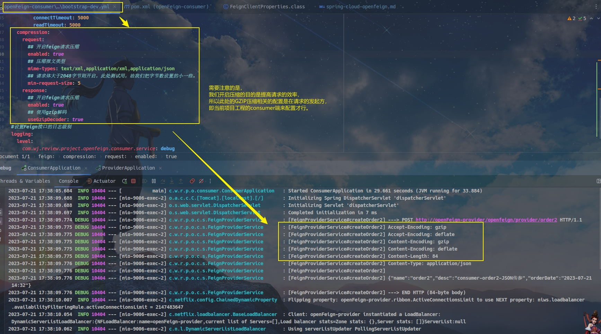

2023年7月22日18:03:48 更新

***熔断降级***

现在来着手开始‘熔断降级’的上手实践。

同样的，整体内容上，还是参照着置顶的帖子来的。

这里我们主要以Sentinel来举例。

不出意外的，还是遇到了新的问题的。

错误信息是如下的这种

com.alibaba.cloud.sentinel.feign.SentinelContractHolder.parseAndValidateMetadata(Ljava/lang/Class;)Ljava/util/List

后面是搁下面的帖子里，找到解决办法的，

https://blog.lanweihong.com/posts/61934/

https://blog.csdn.net/REX1129/article/details/112788895

最终呢，是升级了父pom中的spring-cloud-dependencies.version的依赖版本为Hoxton.SR3，
成功地解决了该问题。

现在又遇到了一个新问题，引入了sentinel后，现在的接口都走的是服务降级的实现类了。

2023年7月22日21:15:04 更新

在将代码中的服务降级类去掉后，发现了问题所在：原来是前面的升级，它需要的feign-httpclient的版本偏低了。
导致原来那些正常的请求都出现了异常，按照sentinel本身的处理逻辑，它们自然就被处理到了fallback指定类的“降级”方法中去了。

将feign-httpclient版本升级为`10.10.1`后，重新再做测试，就能成功地实现 服务降级 的演示了。

从这块儿来讲，sentinel此处也有个不太优雅的地方：默认情况下，如果不对异常做处理的，
在客户端是看不到具体的异常信息的。即我前面提到的‘服务被转发到降级方法’的那种情况。
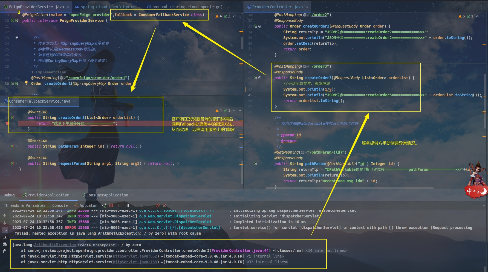
但是在客户端是看不到异常的具体情况的，
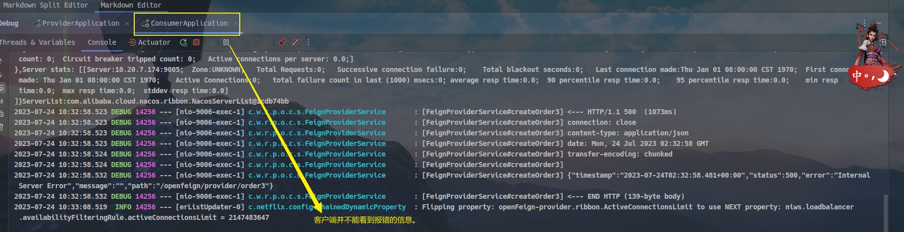

针对这种问题，一般都是会采用 全局统一处理异常的方式来做优化的。

2023年7月24日11:15:38 更新

***全局异常处理***

现在我们来引入全局异常处理，参考帖子是下面这个。
[帖子1-自定义Sentinel全局处理异常](https://juejin.cn/post/7152692717284229133)
[帖子2-# Sentinel之自定义错误处理](https://juejin.cn/post/7136107044834115615)
两个帖子在全局异常的处理上有所差异，但达到的效果应该是一样的。
笔者这里只有按照帖子2的方式才生效了。按帖子1的方式未能生效。
暂时还不知道是什么原因。
这块儿暂时就先不折腾了，先到此为止吧，后面如果有需要深入研究的地方。
再来细究。


